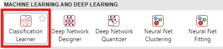
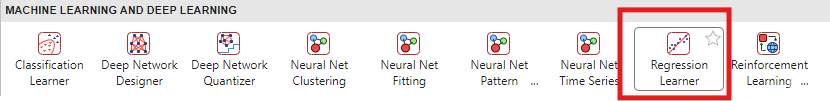
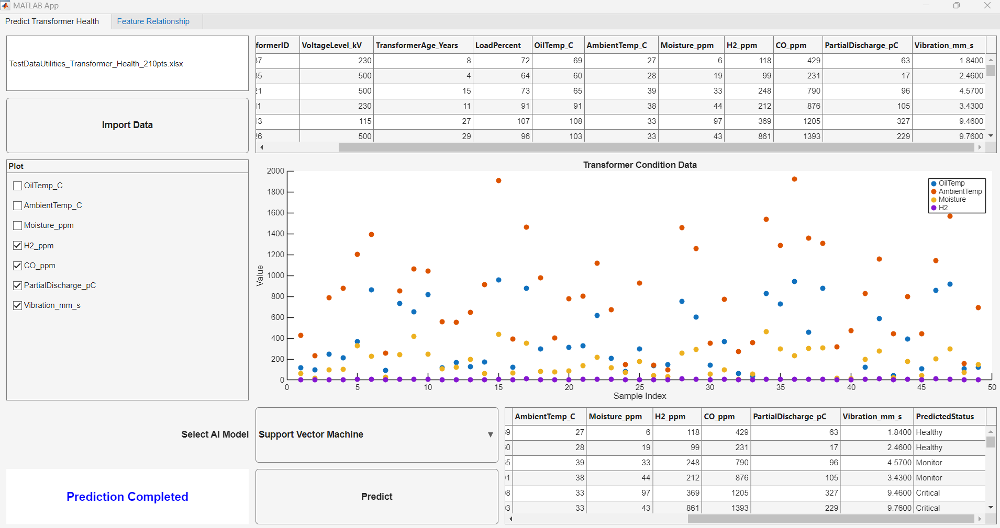

# MATLAB Utilities AI Demo

AI for Transformer Health Monitoring and Anomaly Detection


This repository demonstrates how **MATLAB can be used to develop AI solutions for power utilities**, focusing on **transformer condition monitoring, asset health prediction, and abnormal equipment detection**.


The demo illustrates a complete **AI workflow for utilities**, from data analysis and machine learning model development to application deployment for engineering use.

# Project Overview

Power utilities operate large numbers of transformers across substations. Monitoring the health of these assets is essential to ensure:

-  Reliable power system operation 
-  Early detection of abnormal equipment behavior 
-  Efficient maintenance planning 
-  Reduction of unexpected outages 

Using historical **condition monitoring data**, AI models can help engineers automatically evaluate transformer health and identify potential risks.


This demo shows how MATLAB enables engineers to build and deploy such AI models within a single platform.

# AI Use Cases Demonstrated

The repository contains three demonstrations that represent typical AI applications for utilities.

## **Demo 1 — Predict Transformer Health**

Supervised Machine Learning


Goal


Predict transformer health status using historical monitoring data.


Health categories:

-  Healthy 
-  Monitor 
-  Critical 

MATLAB Tool Used: Classification Learner App




```matlab
%open livescript 1 Predict Transformer Health
edit livescripts\PredictTransformerHealth.mlx
% Launch the classification learner app for model training and evaluation
classificationLearner;
```
## Demo 2 — Detect Abnormal Transformer

Anomaly Detection using Machine Learning


In many real\-world utility systems, data may **not contain labels** indicating whether equipment is faulty.


In this case, AI can be used to learn normal operational patterns and detect abnormal behavior.


This demo predicts a **Health Score** using regression models.


Health Score Interpretation:

-  80–100 → Normal condition 
-  40–80 → Monitor condition 
-  <40 → Potential abnormal transformer 

MATLAB Tool Used: Regression Learner App




```matlab
%open livescript 2 Detect Abnormal Transformer
%launch the regression learner app
regressionLearner;
```
## Demo 3 — Deploy AI Model for Engineering Use

Application Development


After building AI models, they can be deployed into an engineering application.


This demo uses **MATLAB App Designer** to create a simple interface where users can:

1.  Input transformer condition data
2. Run AI prediction
3. View transformer health results

This allows engineers to use AI models without writing code.




```matlab
edit apps\PredictTransformerHealthTemplate.mlapp
```
